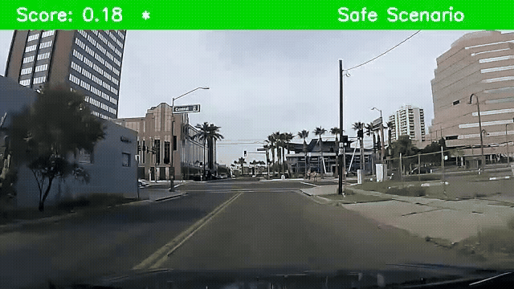

# RiskProp: Collision-Anchored Self-Supervised Risk Propagation for Early Accident Anticipation

<h3 align="center">CVPR 2026 Highlight</h3>

## Overview
RiskProp is a traffic accident anticipation framework for dashcam videos. It predicts collision risk in advance and introduces collision-anchored self-supervised temporal constraints to enforce progressively increasing risk toward the collision point. Instead of relying on dense frame-level risk annotations, RiskProp regularizes the temporal evolution of risk scores using collision supervision, leading to smoother and more collision-consistent anticipation.

Built on [MMAction2](https://github.com/open-mmlab/mmaction2), this repository includes training and evaluation code for early accident anticipation on CAP, DADA, D²-City, and Nexar-style datasets.

<p align="center">
  
</p>

## Installation

```bash
conda create -n riskprop python=3.8.5 -y
conda activate riskprop

pip install -r requirements.txt
pip install torch torchvision
pip install -U openmim
mim install mmengine==0.10.7
mim install mmcv==2.2.0
mim install mmaction2==1.2.0
pip install -v -e .
```

## Data Preparation

Place datasets under `data/` with a layout similar to:

```text
data/
├── MM-AU/
│   ├── CAP-DATA/
│   │   ├── cap_text_annotations.xls
│   │   ├── 1-10/
│   │   ├── 11/
│   │   ├── 12-42/
│   │   └── ...
│   └── DADA-DATA/
│       ├── dada_text_annotations.xlsx
│       └── ...
└── nexar-collision-prediction/
    ├── annotations.csv
    ├── train/
    ├── test/
    ├── train_raw_frames/
    └── test_raw_frames/
```

Dataset roots are defined at the top of each config in `configs/`. The provided configs already contain entries for CAP, DADA, D²-City, and Nexar; enable or disable datasets there as needed.

## Quick Start

### Option 1: Use the wrapper scripts

The repository provides two lightweight wrappers:

- `dist_train.sh`: copies the selected config and `taa/` source into `codes/<name>/<timestamp>/`, then launches distributed training.
- `dist_test.sh`: runs distributed evaluation for the selected config and checkpoint.

Before using them, edit the `name`, GPU list, and checkpoint path inside the scripts if needed.

```bash
bash dist_train.sh
bash dist_test.sh
```

### Option 2: Launch training directly
### Training
```bash
# Main snippet-level anticipation model
CUDA_VISIBLE_DEVICES=0,1,2,3,4,5,6,7 PORT=29500 \
tools/dist_train.sh configs/predict_anomaly_snippet.py 8

# Frame-level anticipation model
CUDA_VISIBLE_DEVICES=0,1,2,3,4,5,6,7 PORT=29500 \
tools/dist_train.sh configs/predict_anomaly_frame.py 8
```

### Evalution
```bash
CUDA_VISIBLE_DEVICES=0,1,2,3,4,5,6,7 PORT=29501 \
tools/dist_test.sh configs/predict_anomaly_snippet.py \
work_dirs/predict_anomaly_snippet/<checkpoint>.pth 8
```

To export predictions for offline analysis:

```bash
tools/dist_test.sh configs/predict_anomaly_snippet.py <checkpoint>.pth 8 \
  --dump outputs/predictions.pkl
```

Checkpoints and logs are saved to `work_dirs/<config_name>/`. The default best-checkpoint criterion is `mAUC@`.

## Config Overview

| Config | Task | Backbone | Temporal Setup |
| --- | --- | --- | --- |
| `predict_anomaly_snippet.py` | Accident anticipation | SlowOnly-R50 | `5` frames x `30` clips |
| `predict_anomaly_frame.py` | Accident anticipation | ResNet-50 + RNN | `1` frame x `30` clips | 
| `predict_occurrence_snippet.py` | Occurrence prediction | SlowOnly-R50 + decoder | `5` frames x `30` clips | 
| `predict_occurrence_frame.py` | Occurrence prediction | ResNet-50 + RNN + decoder | `1` frame x `30` clips | 

## Evaluation Metrics

| Metric | Description |
| --- | --- |
| `mAUC@` | Mean partial AUC with `FPR <= 0.1` at `0.5s`, `1.0s`, and `1.5s` before the accident |
| `mAUC` | Mean full-curve AUC at `0.5s`, `1.0s`, and `1.5s` |
| `mAP` | Mean Average Precision at `0.5s`, `1.0s`, and `1.5s` |
| `mTTA@0.1` | Mean Time-To-Accident at `FPR <= 0.1` |

## Citation

```bibtex
@inproceedings{zou2026riskprop,
  title={RiskProp: Collision-Anchored Self-Supervised Risk Propagation for Early Accident Anticipation},
  author={Zou, Yiyang and Zhao, Tianhao and Xiao, Peilun and Jin, Hongyu and Qi, Longyu and Li, Yuxuan and Liang, Liyin and Qian, Yifeng and Lai, Chunbo and Lin, Yutian and others},
  booktitle={Proceedings of the IEEE/CVF Conference on Computer Vision and Pattern Recognition (CVPR)},
  year={2026}
}
```

## License

This project is released under the [Apache 2.0 License](LICENSE).
